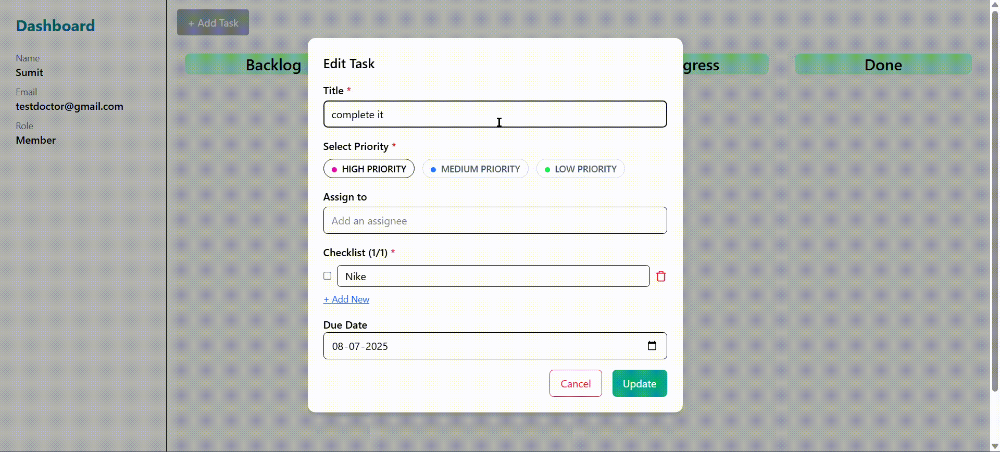

# 🧠 Task Management Dashboard

A collaborative task management tool built with the **MERN stack** (MongoDB, Express, React, Node.js) and **Drag-and-Drop** functionality to organize tasks by status.

> 👤 Built-in role-based access control with JWT authentication — only admins can add tasks!

---

## 📸 Preview



## ✨ Features

- 🔐 **User Authentication** using JWT (includes roles: `admin`, `user`)
- ✅ Create, update, delete tasks
- ✅ Drag-and-drop tasks between columns (Backlog, To Do, In Progress, Done)
- 🧩 Add subtasks (checklist)
- 📅 Set due dates
- 🚫 Non-admins cannot add tasks (toast notification shown)
- 📌 Sidebar with logged-in user info (name, email, role)

---

## 📦 Tech Stack

- **Frontend:** React + Tailwind CSS + Vite
- **Backend:** Node.js + Express + MongoDB
- **Drag and Drop:** `@hello-pangea/dnd`
- **Auth:** JWT-based login
- **Toasts:** `react-hot-toast`

---

## 🚀 Getting Started (Local Setup)

### 📁 1. Clone the Repository

```bash
git clone https://github.com/your-username/your-repo-name.git
cd your-repo-name

cd client
npm install
npm run dev

Your React frontend will be running at http://localhost:5173/

cd server
npm install
npm run dev

PORT=5000
MONGO_URI=your_mongodb_connection_string
JWT_SECRET=your_jwt_secret_key
